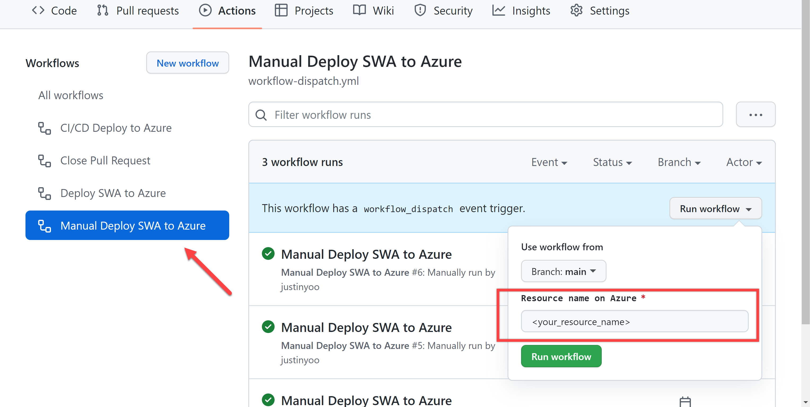

# Token Store: Azure API Management Authorizations

## Prerequisites

-   For Blazor app: [.NET SDK 6.0.300 or later](https://dotnet.microsoft.com/download/dotnet/6.0?WT.mc_id=dotnet-57408-juyoo)
-   For React app: [node.js v14 or later](https://nodejs.org/en/download/)

## Getting Started

### GitHub Secrets

Add the following GitHub Secrets to your repository:

-   `AZURE_CREDENTIALS`: Azure login credentials to get APIM and SWA details. To get this value, refer to [this doc](https://github.com/Azure/login#configure-deployment-credentials).
-   `GH_PAT`: GitHub personal access token to interact with GitHub resources. To get this value, refer to [this doc](https://docs.github.com/en/authentication/keeping-your-account-and-data-secure/creating-a-personal-access-token#creating-a-token).

### Dropbox App

This sample uses the access token issued by [Dropbox](https://dropbox.com). You need to [create an app](https://dropbox.com/developers/apps) for this demo.

### Autopilot

> **This will work only if this repo goes public.**

Click the button below to create and deploy both Blazor WASM app and React app in one go. Note the resource name for later use.

Once completing the resource provisioning above, run the GitHub Action workflow. Make sure to use the same resource name as above.

Once SWA apps are deployed to Azure, create the Dropbox authorization. Here's how it's done directly on Azure Portal.

TBD

### Step-by-Step Instruction

-   Create APIM Token Store
    -   https://github.com/aaronpowell/token-store-demo/tree/main/src/backend
-   Create Azure Static Apps through Azure Portal, with Blazor configurations
    -   Follow [this document](https://docs.microsoft.com/azure/static-web-apps/deploy-blazor#create-a-static-web-app?WT.mc_id=dotnet-57408-juyoo) for publishing.
